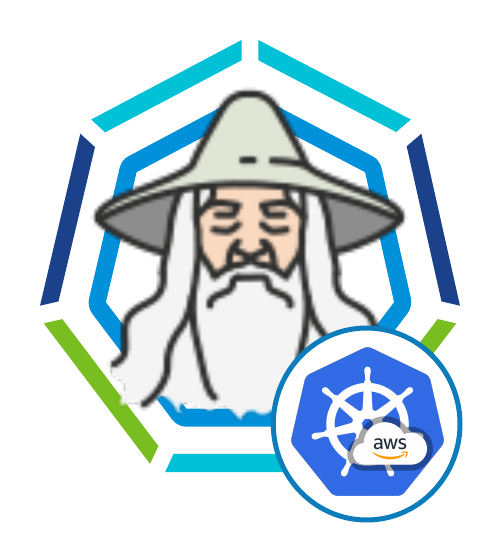

# Tanzu Kubernetes Grid Wizard for TKGm on AWS



**The aim is to simplify and quick start with TKGm.**

The official documentation of Tanzu Kubernetes Grid (https://docs.vmware.com/en/VMware-Tanzu-Kubernetes-Grid/1.3/vmware-tanzu-kubernetes-grid-13/GUID-index.html) contains a detailed way of provisioning management and workload clusters which requires several plugins installed lots for file manipulations and files may conflict if they are not organised properly.

This docker container is a bootstrapped way for achieving the same but a lot simpler. eg: You don't need to install anything on your host machine. Infact, you dont need to install anything. This bootstrapped docker takes care of all the installation prerequisits. It also helps with organising the files location (*eg: Per management cluster and all of its workload cluster you can have one instance of this docker.*)

The bootstrap environment comes with the below pre-installed and some handy wizards to create management and workload clusters and attach clusters to tmc
- aws cli
- kubectl
- tmc cli (optional)
- tkginstall --> lets you create TKG on azure with UI.
- tkgworkloadwizard --> lets you create TKG Workload cluster with simple prompts.
- attact_to_tmc --> lets you attach cluster to Tanzu Mission Control


## Pre-Requisites

### Host machine
You need to have docker-ce or docker-ee on host machine.

### Tanzu CLI binary bundle

Official documentation: 
https://docs.vmware.com/en/VMware-Tanzu-Kubernetes-Grid/1.3/vmware-tanzu-kubernetes-grid-13/GUID-install-cli.html

But the above is simplified. All you need to do is to follow below steps:
- login into https://my.vmware.com
- then go to https://my.vmware.com/en/group/vmware/downloads/info/slug/infrastructure_operations_management/vmware_tanzu_kubernetes_grid/1_x
- Navigate to "Go to downloads" for Tanzu Kubernetes Grid
- 1 file to download
    - Download VMware Tanzu CLI for Linux
        - then `mv ~/Downloads/tanzu-cli-bundle-v1.x.x-linux-amd64.tar binaries/tanzu-cli-bundle-linux-amd64.tar`

### tmc binary (optional but recommended)

Download the tmc binary from `https://{yourorg}.tmc.cloud.vmware.com/clidownload` and place under `binaries` directory. (eg: `mv ~/Downloads/tmc binaries/`)

Without the TMC binary the only option is to use the `TMC_ATTACH_URL` if you want to attach k8s to TMC. With this binary in place it will have more embedded experience meaning the cluster entry in TMC will done from here rather than you creating it manually in tmc to generate the attach url.

***if you do not wish to add tmc binary you MUST comment the lines for adding tmc (line #46 #47) from Dockerfile***


### .env file

`mv .env.sample .env`

Below are the values required:
- AWS_ACCESS_KEY_ID={AWS access keys: https://docs.aws.amazon.com/general/latest/gr/aws-sec-cred-types.html#access-keys-and-secret-access-keys}
- AWS_SECRET_ACCESS_KEY={AWS secret from the above.}
- AWS_SESSION_TOKEN={optional. incase of using a temporaty access using security token https://awscli.amazonaws.com/v2/documentation/api/latest/reference/sts/assume-role.html}
- AWS_REGION={aws region name. List here: https://docs.aws.amazon.com/AmazonRDS/latest/UserGuide/Concepts.RegionsAndAvailabilityZones.html}
- TKR_VERSION={default `v1.20.4---vmware.3-tkg.1`}
    - The default value is the latest at the time of writing this. 
    - This value is used for workload cluster creation using tkgworkloadwizard.sh. 
    - After you provision the management cluster you can get updated value by running `tanzu kubernetes-release get` and picking a version that is compatible=true and upgradable=true. 
    - Also adjust the `TKG_PLAN` according to the TKR you pick. 
    - ***Without right TKR and TKG_PLAN combo you will run into this error `ResourcePurchaseValidationFailed" Message="User failed validation to purchase resources. Error message: 'You have not accepted the legal terms on this subscription: 'xxxxx-xxx-xxx-000-203384034nho' for this plan. Before the subscription can be used, you need to accept the legal terms of the image.`***
- TMC_API_TOKEN={tmc api token for TMC authentication. If not using TMC leave it empty. Follow below steps to generate a TMC API Token:}
    - Navigate to https://console.cloud.vmware.com/csp/gateway/portal/#/user/profile (OR on tmc console click username at the top right corner > click My Accout)
    - API Tokens tab
    - Generate Token and Record the token value. Keep it in a secret secured location as this is the only time you will have opportunity to record it.


## Run / Start

```
docker build . -t tkgonaws
docker run -it --rm --net=host -v ${PWD}:/root/ -v /var/run/docker.sock:/var/run/docker.sock --name tkgonaws tkgonaws /bin/bash
```

# Creating Tanzu Management Cluster

- run the below
```
~/binaries/tkginstall.sh
```
- and follow prompt


*`tkginstall` wizard When run the first time (.env is NOT marked as COMPLETE eg: .env does not have COMPLETE=yes) and it initiates  management cluster creation. Upon completion of management cluster provision, it marks the .env as COMPLETE. When you run `tkginstall` 2nd or more times (.env is marked as COMPLETE eg: .env file contains COMPLETE=yes) and it simple gives shell access where you can execute tanzu commands*

The tkginstall wizard will
- Create security and add as key-pair in aws. It also saves it in the ~/.ssh. If the .pem file exists it will re-use the file to import to aws. Thus you can create your own .pem file and place it in ~/.ssh with naming convention {AWS_REGION_NAME}-keypair.pem and run the wizard to have it imported to AWS. 
- Initiate the UI for creating management cluster


Simple enough with this bootstrapped docker.


# Create workload clusters using Tanzu

The official documentation here: https://docs.vmware.com/en/VMware-Tanzu-Kubernetes-Grid/1.3/vmware-tanzu-kubernetes-grid-13/GUID-tanzu-k8s-clusters-deploy.html

***Using this boostrapped docker when you get bash access you can use it to create workload clusters using tanzu cli OR tkgworkloadwizard*** 

## Workload Wizard:

There are 2 ways to use the wizard:
- the `-f` flag: (`~/binaries/tkgworkloadwizard.sh -f /path/to/configfile`):
    - Create your own configfile and supply the location here. (documentation to create config file here: https://docs.vmware.com/en/VMware-Tanzu-Kubernetes-Grid/1.3/vmware-tanzu-kubernetes-grid-13/GUID-tanzu-k8s-clusters-azure.html). You can add an additional parameter called `TMC_ATTACH_URL` or `TMC_CLUSTER_GROUP` in the config file for attaching the cluster to tmc. This is a special addition to this bootstrap docker.

- the `-n` flag: (`~/binaries/tkgworkloadwizard.sh -n mycluster1` -- **Recommended Approach**) 
    - This will instruct to go into a wizard/guided mode and generate the config file and install the k8s cluster with user input and prompts. For intermidiate usecases tkgworkloadwizard -n is highly recommended.


What the wizard will do:
- The wizard will prompt for configurations details with default values with an option to enter different value. The wizard will navigate through 
    - Whether to deploye the cluster in a shared VPC and NAT
    - Whether new VPC and NAT to be created for the new cluster
    - Whether prod cluster to be deployed using dev control place
    - When it's prod management cluster it by default follow prod workload cluster however that can be overwritten through the wizard prompt as well. 
- The wizard will generate the config file and ask you to review. You can also modify the file.
- Once you have confirmed the configfile on the wizard prompt, it will then proceed to install the workload cluster based on the configfile. This process takes some time (approx 5-15mins depending on the size of the k8s cluster) so grab a coffee or beer or go for a short walk.


## TKR_VERSION (bonus) 

Once you get shell access to the docker container, follow the below steps to get latest TKR_VERSION

- run `tanzu kubernetes-release get` to get the Tanzu Kubernetes Release Version (eg: v1.20.4---vmware.3-tkg.1) and record a compatible=true and upgradable=true version. Fill the value in .env file for `TKR_VERSION` field. 


# Enable Identity Management After Management Cluster Deployment (optional)

*You may choose to do this if you have not registered OIDC/LDAP during the management cluster installation time.*

Doc: https://docs.vmware.com/en/VMware-Tanzu-Kubernetes-Grid/1.3/vmware-tanzu-kubernetes-grid-13/GUID-cluster-lifecycle-enable-identity-management.html

sample config in ~/identity-management/oidc/aws-oidc.sample.yaml

Steps:
- `cp identity-management/oidc/azure-oidc.sample.yaml identity-management/oidc/azure-oidc.yaml`
- Fill out the value in the sample config file at `identity-management/oidc/azure-oidc.yaml` (that one is for Azure, AWS/vSphere would be similar.)
- `export _TKG_CLUSTER_FORCE_ROLE="management"`
- `export FILTER_BY_ADDON_TYPE="authentication/pinniped"`
- `tanzu cluster create CLUSTER-NAME --dry-run -f ~/identity-management/oidc/azure-oidc.sample.yaml > ~/identity-management/oidc/CLUSTER-NAME-example-secret.yaml`
- `kubectl apply -f ~/identity-management/oidc/CLUSTER-NAME-example-secret.yaml`
- check by running `kubectl get app pinniped -n tkg-system`
- if "reconcile failed" then do `kubectl get app pinniped -n tkg-system -o yaml`
